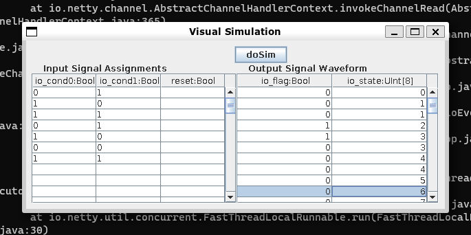

# SpinalVS
A **V**isualized **S**imulation interface for [**Spinal**HDL](https://index.scala-lang.org/spinalhdl/spinalhdl) based on [swing](https://index.scala-lang.org/scala/scala-swing).
## Introduction

- This tool is designed to simulate a synchronous sequential circuit visually. 
- It provided a graphical user interface to fill out the input table and display the output waveform.
- It calls the simulation interface of SpinalHDL and parse the value change dump generated by back end.
## Requirement
A proper SpinalHDL simulation [environment](https://spinalhdl.github.io/SpinalDoc-RTD/master/SpinalHDL/Simulation/install/Verilator.html).
## Usage
1. Copy [the folder](./src/main/scala/spinalvs) to your project
2. Give a `Copmonent` to `SpinalVS`, just the same as `SpinalVerilog`.
3. [Example](./src/main/scala/MyTopLevel.scala#L26):
```scala
SpinalVS(new MyTopLevel)
```
## Features
- support toplevel I/O signals
- support any hardware type in SpinalHDL currently
- simulation results are displayed in a table
## TODO
1. add support for Hi-Z and X
2. add clipboard for work sheet
3. fill random data to input signal
4. support csv file import/export 
5. add svg waveform
6. optimize user interface
